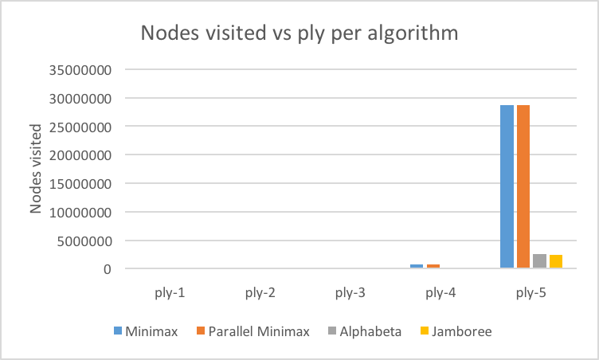
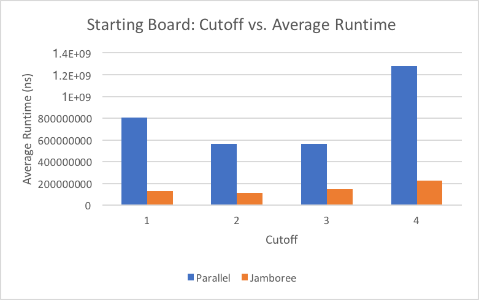
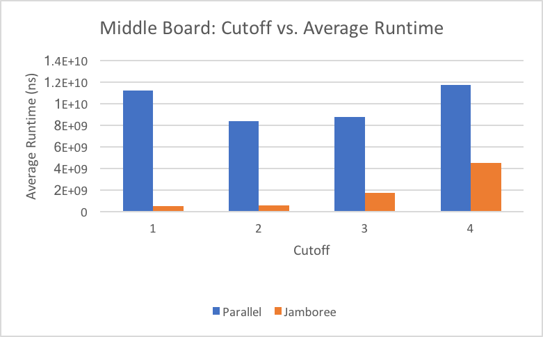
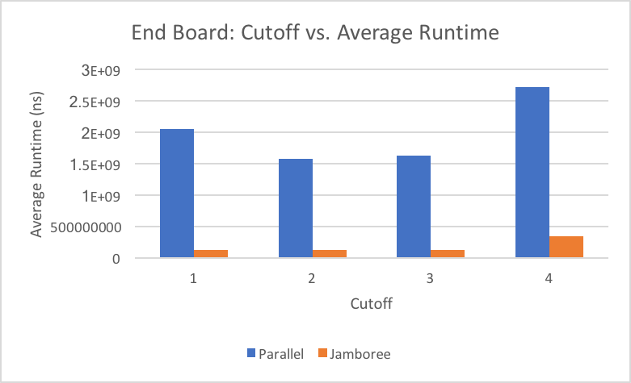
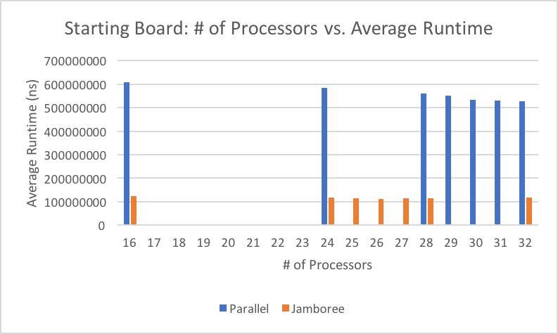
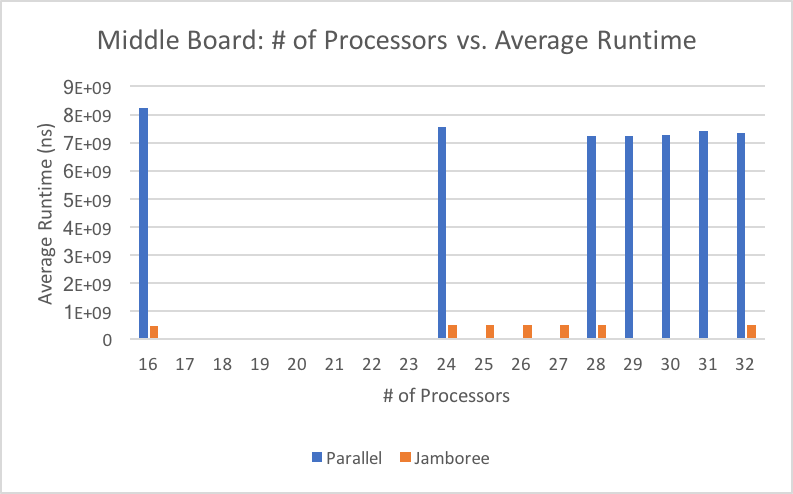
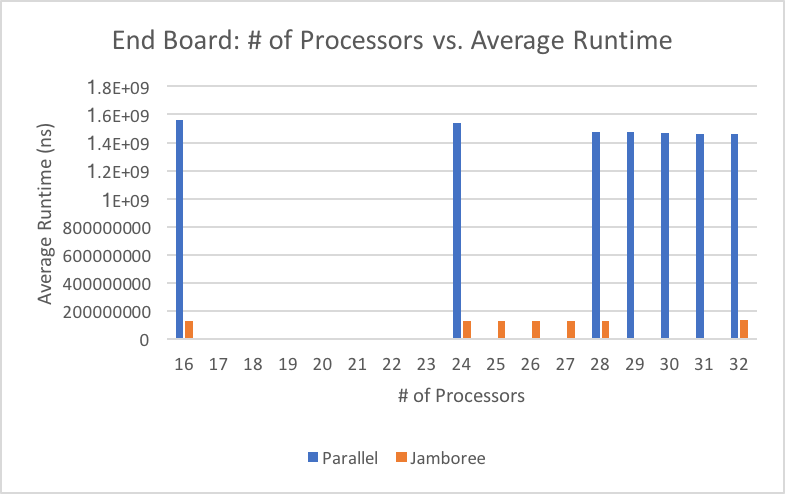
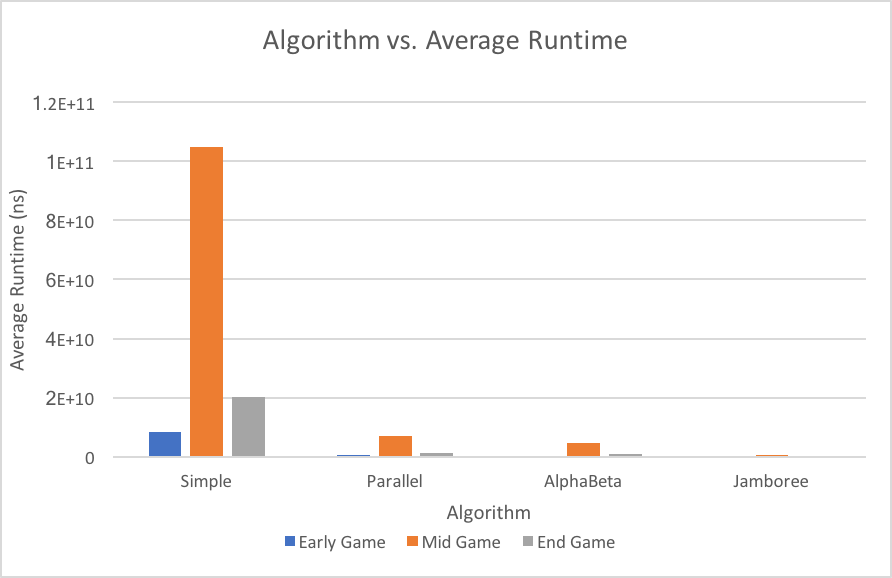

# Project 3 (Chess) Write-Up #
--------

## Project Enjoyment ##
- How Was Your Partnership?
  <pre>Our partnership was very good.</pre>
  
- What was your favorite part of the project?
  <pre>Our favorite part of the project is watching our bot play against clamps and other students' bots. It's satisfying
	to see our implementations come to life in the form of a game.</pre>

- What was your least favorite part of the project?
  <pre>Our least favorite part is debugging parallelism code. A challenge we had was implementing the percentage sequential.
	Keeping track of all of the fields we had in JamboreeSearcher was frustrating too.</pre>

- How could the project be improved?
  <pre>The tests that are given to us should be rewritten or restructured to better accommodate debugging.</pre>

- Did you enjoy the project?
  <pre>We don't particularly enjoy or dislike this project as whole. This is mainly because implementing was a pain, but
	we did enjoy watching our bot in action.</pre>
    
-----

## The Chess Server ##
- When you faced Clamps, what did the code you used do?  Was it just your jamboree?  Did you do something fancier?
  <pre>We used our JamboreeSearcher that has been optimized with move ordering.</pre>

- Did you enjoy watching your bot play on the server?  Is your bot better at chess than you are?
  <pre>We enjoyed watching our bot play on the server and seeing the difference that our optimizations made 
	on its performance. Our bot is better at chess than we are.</pre>

- Did your bot compete with anyone else in the class?  Did you win?
  <pre>Our JamboreeSearcher competed against one other bot in the class and the game ended with a draw.</pre>

- Did you do any Above and Beyond?  Describe exactly what you implemented.
  <pre>No.</pre>

## Experiments ##

### Chess Game ###

#### Hypotheses ####
Suppose your bot goes 3-ply deep.  How many game tree nodes do you think
it explores (we're looking for an order of magnitude) if:
 - ...you're using minimax?
    <pre>We predict, for 3 ply, that minimax will look at 70,000 tree nodes</pre>
 - ...you're using alphabeta?
    <pre>We predict, for 3 ply, that alphabeta will look at 10,000 tree nodes</pre>

#### Results ####
Run an experiment to determine the actual answers for the above.  To run
the experiment, do the following:
1. Run SimpleSearcher against AlphaBetaSearcher and capture the board
   states (fens) during the game.  To do this, you'll want to use code
   similar to the code in the testing folder.
2. Now that you have a list of fens, you can run each bot on each of them
   sequentially.  You'll want to slightly edit your algorithm to record the
   number of nodes you visit along the way.
3. Run the same experiment for 1, 2, 3, 4, and 5 ply. And with all four
   implementations (use ply/2 for the cut-off for the parallel
   implementations).  Make a pretty graph of your results (link to it from
   here) and fill in the table here as well:

<pre>TODO: Fill in the table below</pre>


|      Algorithm     | 1-ply | 2-ply |  3-ply |  4-ply |   5-ply   |
| :----------------: |:-----:|:-----:|:------:|:------:|:---------:|
|       Minimax      |  19   | 734   | 21837  | 687307 | 28699131  |
|  Parallel Minimax  |  19   | 734   | 21837  | 687307 | 28699131  |
|      Alphabeta     |  19   | 264   | 7820   | 205066 | 2608399   |
|      Jamboree      |  19   | 374   | 11458  | 221959 | 2477589   |



#### Conclusions ####
How close were your estimates to the actual values?  Did you find any
entry in the table surprising?  Based ONLY on this table, do you feel
like there is a substantial difference between the four algorithms?
<pre>Our estimates were within reason of the actual values. None of the entries in the table were too surprising, we expected minimax and its parallel counterpart to look at the same number of nodes, since parallel just looks at the nodes in parallel but looks at the same number of nodes. We expected alphabeta to be much smaller than minimax due to pruning. We expected Jamboree to explore fewer nodes than alphabeta, however, this wasn't necessarily the case. Jamboree sometimes explored more nodes than alphabeta, since some of the parallel tasks for jamboree explored branches that would've been pruned by alphabeta. So there definitely is a substrantial difference between minimax/parallelminimax and alphabeta/jamboree in terms of nodes visited, the pruning function of alphabeta greatly decreased the number of nodes visited. </pre>

### Optimizing Experiments ###
THE EXPERIMENTS IN THIS SECTION WILL TAKE A LONG TIME TO RUN. 
To make this better, you should use Google Compute Engine:
* Run multiple experiments at the same time, but **NOT ON THE SAME MACHINE**.
* Google Compute Engine lets you spin up as many instances as you want.

#### Generating A Sample Of Games ####
Because chess games are very different at the beginning, middle,
and end, you should choose the starting board, a board around the middle
of a game, and a board about 5 moves from the end of the game.  The exact boards
you choose don't matter (although, you shouldn't choose a board already in
checkmate), but they should be different.

#### Sequential Cut-Offs ####
Experimentally determine the best sequential cut-off for both of your
parallel searchers.  You should test this at depth 5.  If you want it
to go more quickly, now is a good time to figure out Google Compute
Engine.   Plot your results and discuss which cut-offs work the best on each of
your three boards.




<pre>
Using Jamboree with the ordering optimization, we found that generally the best cutoff is 2. The comparison between a cutoff of 1 and 2 yielded very close results in all three board state cases, however with a starting board the cutoff of 2 led to the lowest runtime.

For ParallelMinimax, we also found that 2 was the best cutoff. We expected a higher cutoff due to the sequential nature of minimax that doesn't use pruning. We believe that ParallelMinimax wasn't using an optimal number of processors, so it was executing fewer parallel tasks. 
</pre>

#### Number Of Processors ####
Now that you have found an optimal cut-off, you should find the optimal
number of processors. You MUST use Google Compute Engine for this
experiment. For the same three boards that you used in the previous 
experiment, at the same depth 5, using your optimal cut-offs, test your
algorithm on a varying number of processors.  You shouldn't need to test all 32
options; instead, do a binary search to find the best number. You can tell the 
ForkJoin framework to only use k processors by giving an argument when
constructing the pool, e.g.,
```java
ForkJoinPool POOL = new ForkJoinPool(k);
```
Plot your results and discuss which number of processors works the best on each
of the three boards.




<pre>
Using Jamboree with the ordering optimization, we got some close data, yielding an optimal # of processors somewhere between 26 and 28. (26 -> start board, 27 -> mid board, 28 -> end board).

Using ParallelMinimax we found that more processors worked. For start and end, the optimal number was 32 while for middle it was 28. We believe ParallelMinimax requires more processors than Jamboree because it has to look at far more nodes in parallel, since jamboree using alphabeta pruning.
</pre>

#### Comparing The Algorithms ####
Now that you have found an optimal cut-off and an optimal number of processors, 
you should compare the actual run times of your four implementations. You MUST
use Google Compute Engine for this experiment (Remember: when calculating
runtimes using *timing*, the machine matters).  At depth 5, using your optimal 
cut-offs and the optimal number of processors, time all four of your algorithms
for each of the three boards.

Plot your results and discuss anything surprising about your results here.

|      Algorithm     | Early Game | Mid Game   | End Game  |
| :----------------: |:----------:|:----------:|:---------:|
|       Minimax      |8445751989  |105019099392|20226732392|
|  Parallel Minimax  |433746706   |7031689998  |1236097419 |
|      Alphabeta     |303155795   |4680358085  |786881072  |
|      Jamboree      |119566378   |530076632   |130454252  |




<pre>
For this we timed the runtimes of each algorithm on GCE using the optimal number of processors and optimal sequential cutoff discussed in the previous two tests. We clearly see that jamboree yields the best results of the four algorithms, while minimax performed worse than the rest for all game states. However, alphabeta performed better than parallelminimax, showing that pruning is still more advantageous than parallel computing in this case. Jamboree took the best of both worlds, in addition to our move sorting, which gave it such a low runtime in comparison. ParallelMinimax was clearly more efficient than minimax, and Jamboree was clearly more efficient than AlphaBeta, showing that parallelized versions of sequential programs are clearly faster. Mid game test always took longer than early/end games tests due to the number of move options at this point in the game.
</pre>

### Beating Traffic ###
In the last part of the project, you made a very small modification to your bot
to solve a new problem.  We'd like you to think a bit more about the 
formalization of the traffic problem as a graph in this question.  
- To use Minimax to solve this problem, we had to represent it as a game. In
  particular, the "states" of the game were "stretches of road" and the valid
  moves were choices of other adjacent "stretches of road".  The traffic and
  distance were factored in using the evaluation function.  If you wanted to use
  Dijkstra's Algorithm to solve this problem instead of Minimax, how would you
  formulate it as a graph?
  <pre>To use Dijkstra's algorithm instead of minimax would requiring creating a graph of seattle. In this graph each intersection of two or more roads would be a node, and each road would be an edge. The roads would be weighted by average speed that a driver drives at that time of day (probably from data collected on speeds for that road). So roads with higher average speeds would be weighted less than roads with lower average speeds.</pre>

- These two algorithms DO NOT optimize for the same thing.  (If they did,
  Dijkstra's is always faster; so, there would be no reason to ever use
  Minimax.)  Describe the difference in what each of the algorithms is
  optimizing for.  When will they output different paths?
  <pre>Minimax and Dijkstra's algorithms work differently, minimax looks between two points while Dijkstras finds the shorted past from one point to all others. Dijkstras algorithm finds the path from start to end, while minimax works along the way. So sudden changes to road conditions will cause Dijktras to fail since it didn't anticipate a certain road's weight going up or down suddently while en route. Dijkstras algorithm will always find the shortest greedy path, while minimax depends on the set depth, it might choose a wrong path if it doesn't look far enough ahead. </pre>